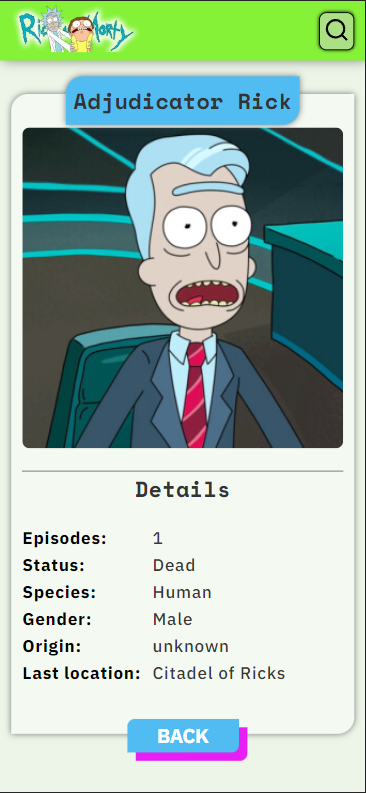

# Single-page-aplication
Single page aplication con JavaScript vanilla, consume un api rest y muestra los resultados con scroll infinito, la pagina es modular, esta dividida en componentes que se pueden integrar o quitar.

Demo:https://100tifico.netlify.app

## pagina de busqueda

Se puede filtrar y buscar el personaje que quieras.

## Pagina de detalles de personaje responsive
Pagina de detalles del personaje que seleccionas, la pagina es responsive desing.

## Pagina de error 404

En caso de ir a una pagina que no exista o en caso de que no se encuentre informacion de un filtro o busqueda sale esta pagina.

